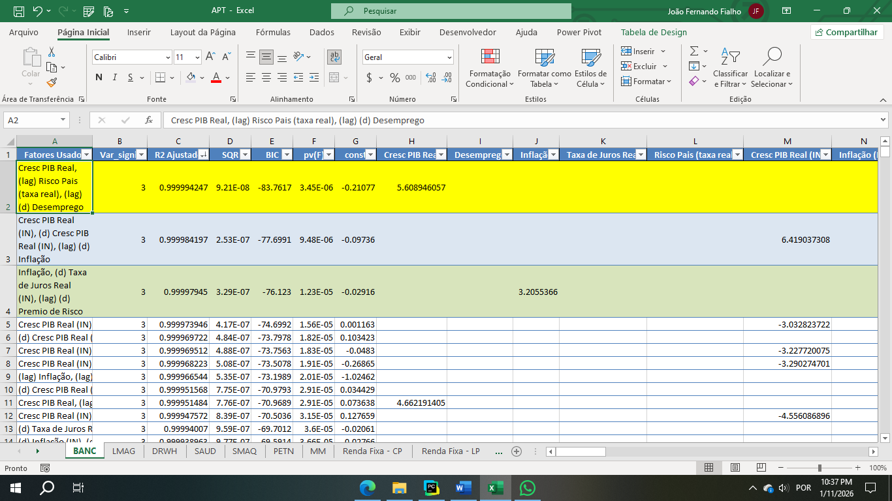
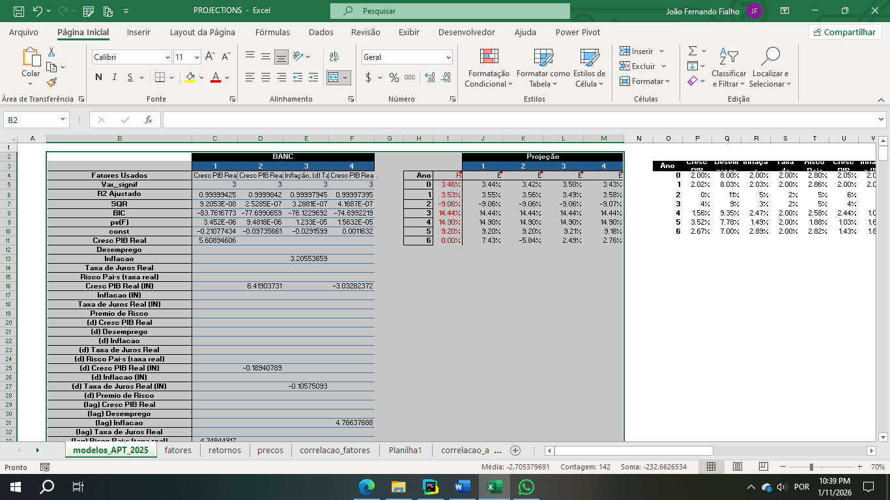
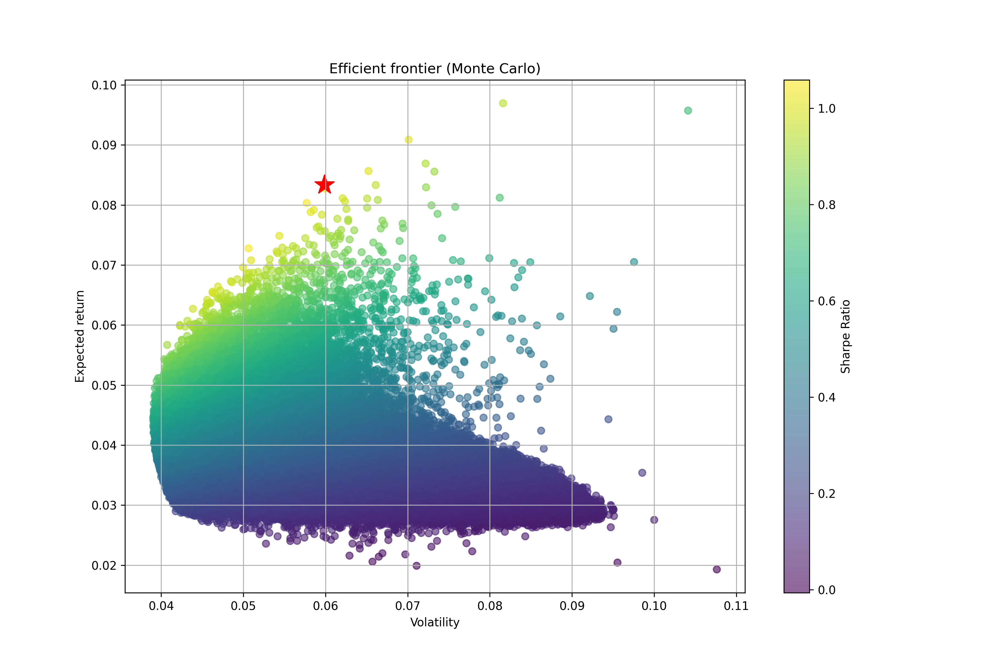
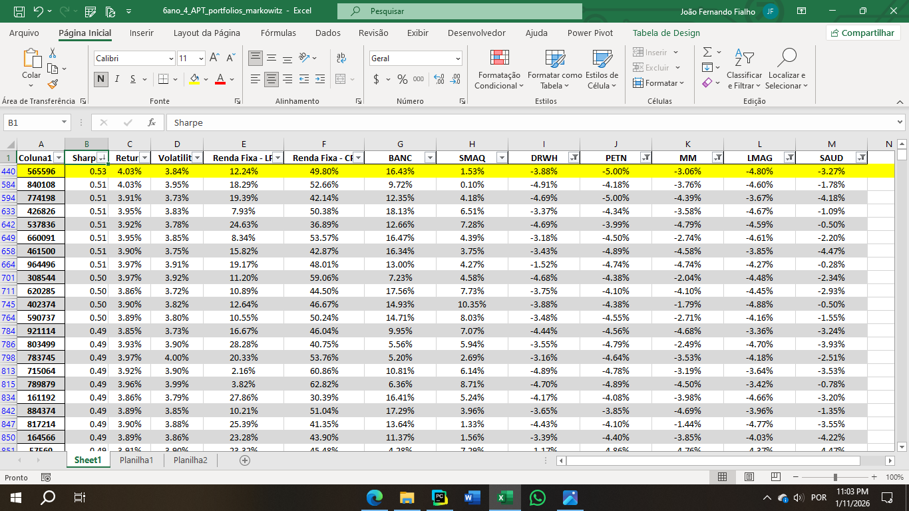

# ÁGORA CHALLENGE 2025
#### Asset Price Theory (APT) + Otimização de Portfólio (Markowitz)

## 📌 Visão Geral

Este projeto foi desenvolvido para o **ÁGORA CHALLENGE 2025** e tem como objetivo construir uma carteira ótima de ativos a partir de uma abordagem **top-down macroeconômica**, combinando:

* Modelagem de retornos esperados via **Arbitrage Pricing Theory (APT)**
* Seleção econômica e estatística de modelos fatoriais
* Otimização de portfólio via **Markowitz (Monte Carlo)** com foco em maximização do **Sharpe Ratio**

O pipeline completo é dividido em **três grandes etapas**, desde a coleta de dados macroeconômicos até a seleção da carteira eficiente.

---

## 🧠 Metodologia Geral

### 🔹 Etapa 1 — Modelagem de Retorno Esperado (APT)

Nesta etapa, o objetivo é estimar o **retorno esperado de cada ativo** com base em fatores macroeconômicos.

$\mathbb{E}[R_{i}] = \text{Retorno Esperado}$

$F_{j} = \text{Variável Macro}$

$\beta_{j} = \text{Coeficiente}$

$$\mathbb{E}[R_{i}] = \alpha_i + \sum \beta_{j} F_{j} + \varepsilon_{i}$$


**Descrição:**

* Coleta dos dados macroeconômicos referentes à rodada atual do desafio
* Utilização de **9 variáveis macroeconômicas reais**, transformadas em **36 fatores** (defasagens, variações, normalizações, etc.)
* Para cada ativo:

  * São testadas aproximadamente **8.000 regressões APT**
  * Avaliação exaustiva de combinações de fatores

**Critérios de avaliação:**

* Significância estatística dos coeficientes
* Qualidade do ajuste (R² ajustado)
* Coerência econômica dos sinais

A execução desta etapa ocorre via:

```bash
python run_apt.py
```

Os resultados são exportados para um arquivo Excel contendo os **modelos ranqueados por ativo**.




---

### 🔹 Etapa 2 — Seleção Econômica do Modelo

Apesar do ranqueamento quantitativo, a decisão final é **econômica e direcional**.

**Processo:**

* Seleção dos **Top 5 modelos estatisticamente mais explicativos** por ativo
* Avaliação manual considerando:

  * Cenário macroeconômico vigente
  * Sinal esperado dos fatores
  * Consistência econômica

**Resultado:**

* Definição do **retorno esperado final** de cada ativo

> ⚠️ Esta etapa evita overfitting puramente estatístico e incorpora julgamento macroeconômico.



---

### 🔹 Etapa 3 — Otimização de Portfólio (Markowitz)

Com os retornos esperados definidos, constrói-se a carteira ótima.

**Inputs:**

* Retornos esperados (APT)
* Volatilidade estimada via **EWM (Exponentially Weighted Moving Average)**


**Metodologia:**

* Simulação de 1.000.000 de **portfólios aleatórios (Monte Carlo)**
* Cálculo de retorno, risco e **Sharpe Ratio**
* Aplicação de **restrições de alocação**
* Seleção da **carteira eficiente** (máximo Sharpe)

Execução via:

```bash
   python run_markowitz.py
```





---

## 📁 Estrutura do Projeto
Visão geral dos principais diretórios e arquivos:

```
.
├── requirements.txt
├── README.md
├── results/                # Saídas da otimização de portfólio
│
├── projections/            # Resultados intermediários (APT e projeções)
│   ├── APT.xlsx
│   └── PROJECTIONS.xlsx
│
├── src/
│   ├── models.py           # Implementação do APT
│   └── markowitz.py        # Markowitz (Monte Carlo)
│
├── run_apt.py              # Execução das regressões APT
└── run_markowitz.py        # Execução da otimização de portfólio

```

---

## ▶️ Configuração do Ambiente

Antes de executar, crie um ambiente virtual (venv). Certifique-se de ter o (Python >= 3.12) instalado.

1.  **Clone o repositório (se aplicável):**

    ```bash
    git clone <https://github.com/JoaoFialho1/AgoraChallenge2025>
    cd AgoraChallenge2025
    ```

2. **Crie um ambiente virtual, digite no terminal:**
    ```bash
    python -m venv .venv
    ```

3. **Ative o ambiente virtual:**
    *   No Windows:
        ```bash
        .\.venv\Scripts\activate
        ```
    *   No macOS/Linux:
        ```bash
        source .venv/bin/activate
        ```

4.  **Instale as dependências necessárias:**
    ```bash
    pip install -r requirements.txt
    ```

---
## ▶️ Fluxo de Execução

1. Atualizar dados macroeconômicos
2. Rodar APT:

    ```bash
    python run_apt.py
    ```

3. Selecionar modelo econômico por ativo
4. Atualizar retornos esperados
5. Rodar Markowitz:

    ```bash
    python run_markowitz.py
    ```

---

## 👨‍💻 Autor

**João Fernando Fialho Soares**

LinkedIn: [https://www.linkedin.com/in/joaoffialho/](https://www.linkedin.com/in/joaoffialho/)